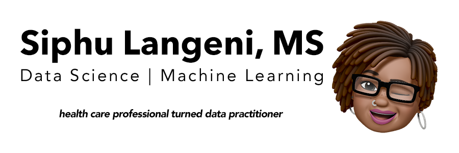

## Hello World!

I'm Siphu Langeni - a health care professional turned data practitioner. Welcome to my GitHub, home of my curiosity, code and collaboration.

 

**Let's connect:**  

<!-- GitHub -->
[][github]

<!-- LinkedIn -->
[][linkedin]

<!-- Medium -->
[][medium]

<!-- Twitter -->
[][twitter] 

 

**Languages and Tools:**  

<!-- python -->

<!-- Scikit-Learn -->

<!-- TensorFlow -->

<!-- R -->

<!-- Tidyverse -->

<!-- SQL -->

<!-- PostgreSQL -->

<!-- Heroku -->

<!-- Docker -->

<!-- HTML -->

<!-- Bootstrap -->

<!-- git -->

<!-- GitHub -->

<!-- Terminal -->

<!--  -->

[github]: https://github.com/SiphuLangeni
[linkedin]: https://linkedin.com/in/SiphuLangeni
[medium]: https://towardsdatascience.com/@SiphuLangeni
[twitter]: https://twitter.com/SiphuLangeni
